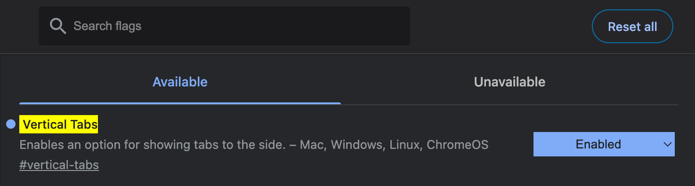
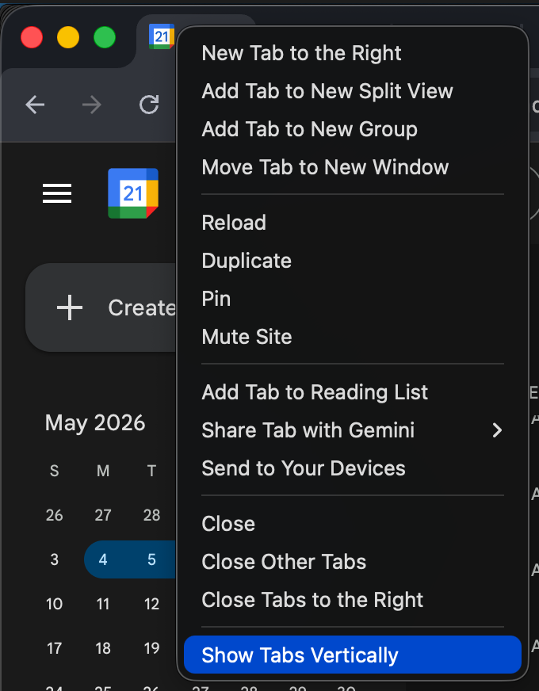
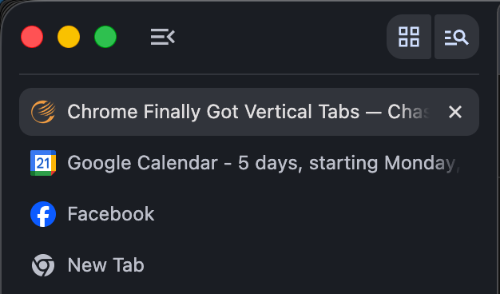

One of the most consistent frustrations I run into when working in Chrome (or any browser for that reason) is that I have way too many tabs open. It often gets to the point where these tabs are so many in number that the icons are the only thing that show up on screen. When I have multiple tabs open at the same site with different intentions, it can make it difficult to determine which of these tabs I was actively working on.

Maybe this is just my poor browser utilization practices coming into focus; however, [human behavior is generally hard to change](https://www.psychologytoday.com/us/blog/neuronarrative/201707/8-reasons-why-its-so-hard-to-really-change-your-behavior). Therefore, I've accepted the fact that I'm someone who needs a lot of context visible to feel organized.

I typically have a pull request that I'm reviewing open in one tab and an open PR for a different project in another, waiting for the build to turn green. My Gmail, Google Calendar, Notion, and a Jira ticket board are usually open too, along with a few other tabs I haven't gotten around to closing. Even when I'm on a 32-inch ultra-wide monitor, I still end up with tab compression that makes it difficult to see what I actually have open and what I'm supposed to be doing in each one.

As a developer, I've wired myself to think of information organized on a vertical axis. Between my file trees and change sets I've trained myself to follow that mentality. So when a coworker dropped this in Slack and I saw that Chrome now supports vertical tabs, it was the next thing I set up that day.

## How You Can Enable It

1. Open `chrome://flags/#vertical-tabs` and set it to **Enabled**

   

2. Relaunch Chrome
3. Right click on any tab and click 'Show Tabs Vertically'

   

Note: You can always switch back by right clicking on the tab and clicking 'Show Tabs Horizontally'.

## What I've Noticed Since Turning It On

Once the tabs move to the side you can drag them up and down freely. I've started treating the top of the list like a priority queue. Whatever I'm actively working on lives at the top and things that are lower priority fall away toward the bottom (or I close them). It makes it much easier to context switch without losing track of what actually matters right now.

Candidly, this isn't a groundbreaking feature. Edge has had it since 2021. But it's here in Chrome now, it takes about thirty seconds to turn on, and if you're someone who spends most of their day in a browser with a lot of tabs open, it's worth trying.
